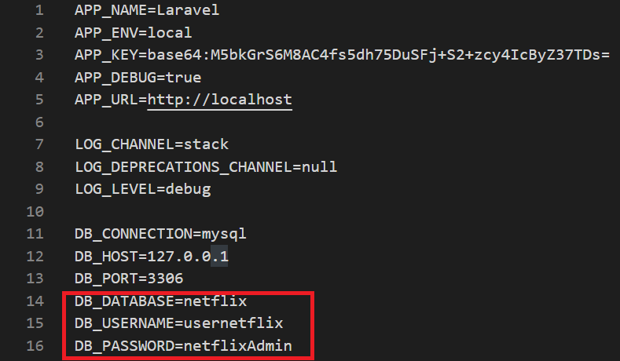

## Installation :

* #### Cloner le projet dans votre répertoire
	`git clone https://forge.univ-lyon1.fr/p1911249/movie-database-isi2 Netflix`

* #### Lancer le serveur local
	`sudo service mysql start`
	`sudo service apache2 start`

* #### Créer un utilisateur

	> Il suffit de lancer le script **createUser.sql** dans datagrip.

* #### Modifier le fichier env

	> Se déplacer dans le dossier **netflix** puis copier-coller le fichier **.env.example** en le renommant **.env**. 
	>Modifier le fichier **.env** comme ci-dessous.
	
	

* #### Générer les dépendances
	`composer update`

* #### Modifier les permissions:
	`sudo chown -R $user :www-data storage`
	`sudo chown -R $user :www-data bootstrap/cache`
	`sudo chmod -R 775 storage`
	`sudo chmod -R 775 bootstrap/cache`

* #### Actualiser la clé du projet
	`php artisan key:generate`
* #### Créer les migrations

	> Lancer la commande suivante :
	
	`php artisan migrate`
* #### Insérer les données dans la base de donnée

	> Lancer le script **netflix.sql** dans datagrip.
	
* #### Vérifier que tout fonctionne 😉

	> Aller à l'adresse http://localhost/web/Netflix/netflix/public/home
  
    
    
## License 

Copyright Lilian LABROSSE & Sacha MONTEL
Based on Netflix inc.
