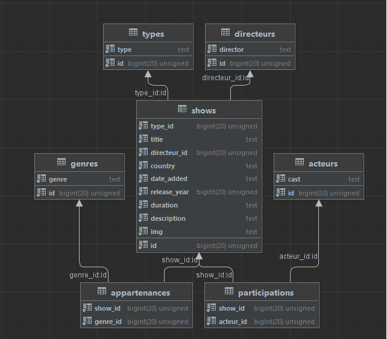

## Installation:

* #### Cloner le projet dans votre répertoire
	`git clone https://forge.univ-lyon1.fr/p1911249/movie-database-isi2 Netflix`
* #### Créer les migrations
	`php artisan migrate`
* #### Insérer les données dans la base de donnée
	> Récupérer le script SQL **netflix.sql** et le lancer dans datagrip.
* #### Lancer le serveur local
	`sudo service mysql start`
	`sudo service apache2 start`
* #### Vérifier que tout fonctionne 😉
	> Aller à l'adresse http://localhost/web/Netflix/netflix/public/home
  
    
    
## Introduction :

Nous avons choisi de faire une copie de Netflix. Ainsi, notre site web regroupe différents films et séries du service de streaming. L’utilisateur pourra ainsi parcourir le contenu proposé sur notre site, et accéder à ces informations.
Nous avons choisi un jeu de données provenant du site [kaggle](https://www.kaggle.com/datasets/shivamb/netflix-shows) et regroupant les informations dont nous avons besoin. Par la suite, nous avons dû traiter ce jeu à l’aide de scripts python, en le séparant en 7 fichiers **csv**, chacun représentant une table de notre base de données afin de pouvoir l’importer par la suite. De plus le jeu de données étant relativement important (+8000 show), nous avons choisi de nous restreindre à 150 shows.
Notre base de données contient quant à elle 7 tables, représentées ci-dessous.

## Description des tables :

  

La table **show** contient les informations du show.

La table **genres** contient les différentes catégories que peut avoir un show (ex : Horreur).

La table **acteurs** contient les acteurs ayant joué dansdes shows.

La table **directeurs** contient les directeurs ayantdirigé des shows.

La table **types** contient les deux types que peuventprendre un show (TV show ou Movie).

Les tables **appartenances** et **participations** permettentde lier les tables acteurs et genres

avec la table shows afin d’avoir des relations 1..n au lieu de n..n.

  

## Le fonctionnement du site:

  

La page d’accueil est la suivante, elle permet d’afficher les films et séries de 3 genres différents, les animés, les films romantiques et les films d’horreur. Nous voyons également notre barre de navigation accueillant 3 liens de navigation ainsi que ceux de connexion que nous détaillerons par la suite. Cette barre est présente sur toutes les pages du site grace aux layouts. Si nous cliquons sur le lien “Films” nous accédons à une page regroupant tous les films de la base de données.
  

De même pour le lien “Séries”:

  

Sinouscliquonssurunfilmsansêtreconnecté,onnousproposedenousconnecterpour

accéder au contenu du programme.

  

Cliquons alors sur le lien “Se connecter”.

  
  

On remarque dans la barre de navigation que l'utilisateur est bien connecté car son nom

apparaît.

  

Nous pouvons donc cliquer sur un film pour accéder à son contenu.

  

A partir de cette vue nous pouvons accéder à la page des acteurs en cliquant le nom d’un

de ces derniers. On clique ici sur l’actrice “Chie Nakamura”, on a donc accès à tous les films

dans lesquels elle à joué.

  
  

En revenant sur la page de contenu d’un programme on peut cliquer sur un des “Genres”

pour accéder à la page contenant tous les films appartenant à ce genre. Ici nous avons

cliqué sur le genre “International Movies”.

  
  

## Les modèles :

  

Nous avons 8 modèles Acteur, Appartenance, Directeur, Genre, Participation, Show, Type et

User. Chacun d'eux est liée à une table de notre base de données. Voici la représentation de

nos modèles dans Laravel.

  

## Les vues :

  

Nous utilisons un seul layout “homeLayout.blade.php”, les autres sont ceux créés

automatiquement par laravel. Il permet de définir pour toutes les vues la même structure de

page, c'est-à-dire la navbar et le footer.

  

Nous avons 6 vues et chacune d’elle est associée à une page du site

  

### .

  

La vue **acteurs** permet d’afficher les film d’un acteur.

La vue **genres** permet d’afficher les films d’un mêmegenre.

  
  

La vue **index** est la page d’accueil qui affiche plusieurs films de notre BD.

La vue **movies** permet d’afficher tous les films dela BD.

La vue **show** permet d’afficher les informations d’unshow.

La vue **tv** permet d’afficher toutes les séries de laBD.

  

## Les contrôleurs :

  

Nous avons créé 7 contrôleurs : ActeurController, DirecteurController, GenreController,

MovieController, ShowController, TvController, TypeController.

  

Le contrôleur **show** à deux méthodes. La méthode indexrenvoie trois types de show

différents, des animes, des horreurs et des romantiques.

  
  

La méthode show qui prend en paramètre l’id d’un show. Et qui renvoie toutes les

informations liée à celui-ci (acteurs, directeurs, descriptions, nom, ...).

  

Le contrôleur **acteur** à une méthode show prenant enparamètre l’id d’un film. Afin de nous

permettre de récupérer tous les acteurs qui ont joué dans ce film.

  

Le contrôleur genre à une méthode show qui prend en paramètre l’id d’un film. Et qui

retourne les films ayant le même genre que celui passé en paramètre.

  
  

Le contrôleur **TV** à une méthode index qui récupèretous les show ayant le type 2 (TV

show).

  

Le contrôleur **Movie** à une méthode index qui renvoietous les films de la base de données.

  
  

## Les routes :

  

Voici nos 7 routes, associées à chacune des pages de notre site. Les deux premières

servent à afficher la page d’accueil. les 4 suivantes affichent leur page éponymes. Enfin la

dernière permet de gérer l’authentification.

  

## Les migrations :

  

Voici un exemple de migration pour la table show.

  
  

## Les étapes :

  

Etape 1 : Création du jeu de données

Etape 2 : Création des model avec make Model –migration

Etape 3 : Création des migrations

Etape 4 : Insertion du jeu de données dans la BD

Etape 5 : Création des contrôleurs

Etape 6 : Création des vues

Etape 7 : Création des routes